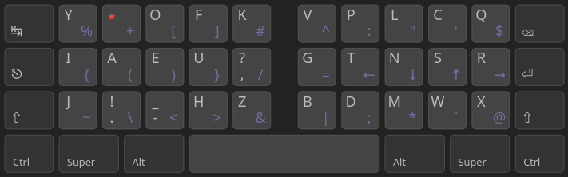
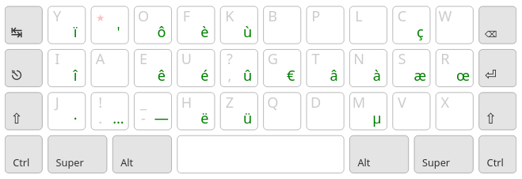

# Erglace

## Ressources utilisées

- [Keyboard Layouts Doc](https://bit.ly/keyboard-layouts-doc), ressource théorique très complète
- Page dev de [Ergo-L](https://ergol.org/dev), pour la plupart des statistiques
- [Layout playground](https://o-x-e-y.github.io/layouts/playground/), pour des statistiques complémentaires (LSB, BadRedirects) et du prototypage rapide
- Les [statistiques de Ergo-L](corpus/) pour le français et l'anglais
- [Heatmap d'effort](https://colemakmods.github.io/mod-dh/model.html) des touches du clavier, développée pour Colmak-DH
- Les retours sur le [discord d'Ergo-L](https://discord.gg/RH34GjQEgC)

## Layout

## Notes de conceptions

- Le point de départ était de faire une disposition avec moins de redirections que Ergol-L. Nous nous sommes vite rendu compte qu'il fallait pour cela isoler les voyelles de consonnes. Les lettres de la home row sont les lettres les plus utilisées du français et de l'anglais.

- Les voyelles sont à gauche car ErgEAU tire profit des touches disponibles tout à droite pour rajouter des consonnes rares. Par ailleurs, c'est aussi le choix de Bépo et Optimot, ce qui permet des transitions plus faciles.

- Pour l'ordre des consonnes de la home row, nous avons cherché à maximiser les roulements, tout en s'assurant d'une bonne répartition de la charge. `t` est un bon candidat pour l'index, puisqu'il se combine assez peu avec d'autres consonnes comparé aux autres, or l'index à 6 lettres. Les autres ordres testés avaient une répartition de charge moins bonne et/ou un SFB plus haut. Cet ordre  a toutefois le défaut de privilégier les outrolls, et n'est pas celui qui minimise les redirects (voir l'ordre de Nerps).

- Le raisonnement est similaire pour l'ordre des voyelles. `u` est de loin la lettre qui se combine le moins avec les consonnes et les signes de ponctuation, il a donc sa place sur l'index, même si c'est une lettre peu courante en anglais. Le roulement `eau`, courant en français, a donné l'ordre de voyelles de ErgEAU.

- Toutefois, `e` est une lettre particulière puisque c'est la plus utilisée et elle se combine avec la quasi-totalité des autres lettres, à l'exception de `o` et des lettres accentuées. N'ayant pas de touches dédiées aux accents comme ErgEAU, j'ai dû me résoudre à mettre `o` au-dessus de `e`. La charge devenant trop grande pour l'annulaire, je l'ai mis sur l'index comme en Ergo-L et Optimot. `a` est resté sur l'annulaire car il a une charge plus importante que `i`. Les enchaînements de cette disposition restent bons, à l'exception du bad redirect assez ironique `aie`, équivalent de `sad` en qwerty.

- J'ai essayé de laisser `e` sur l'annulaire, d'abord en mettant la touche morte au-dessus, ce qui faisait une charge beaucoup trop importante pour l'annulaire, ou en mettant une lettre rare, tel que `k` ou `z`, mais le SFB engendré était de loin le plus important du layout, et je trouvais dommage de mettre une des lettres les plus rares sur un bon emplacement.

- Nous avons d'abord cherché à conserver le roulement `th`, digramme le plus commun. Mais nous nous sommes rendu compte que `h` allait aussi très bien du côté des voyelles avec lesquelles il fait de nombreux roulements, même si ce sont des outrolls. Avoir `h` sous `u` permet aussi de charger plus l'index en anglais.

- Les autres consonnes du côté de voyelles ont été choisies pour minimiser le SFB. `j` est en bas pour simplifier l'écriture de `je`, et `f` en haut pour taper `of`. `y` en haut permet quant à lui un roulement confortable pour écrire `you`. Une attention particulière a été portée sur le LSB, qui reste malgré tout élevé à cause des digrammes `e,`, `ez` et `ek`, ce qui est assez inévitable compte tenu du placement de `e`.

- La charge de l'annulaire est alors plus importante que celle de l'index en français. J'ai essayé de mettre la touche morte sur l'index comme en ErgEAU, mais comme `e`, `a` se lit à presque toutes les autres lettres. On retrouve donc les mêmes problèmes qu'avec `e`, mais cette fois avec une charge trop faible sur l'annulaire. Par ailleurs, le touche morte sur l'index réduisait encore la charge de ce doigt en anglais.

- Le placement des consonnes restantes à droite à fait l'objet des beaucoup de variations. `dmlc` sont celles qui ont le moins bougé, étant les consonnes plus fréquentes après celle de la home row, elles occupent les meilleurs emplacements sur les colonnes où elles font le moins de SFB. Le placement de `cl` en haut permet de garantir les roulements entre ces deux lettres.

- Les consonnes restantes peuvent être permutées facilement, en particulier `bgpqv`. `p` étant la plus commune, et faisant un digramme important avec `l`, elle a la place du dessus. Viens ensuite `g`, qui participe à deux digrammes importants, `ng` et `gr`. Le placer en bas l'annulaire rend ces digrammes inconfortables. Pour ne pas avoir un trop gros LSB avec le digramme `ng`, la seule position restante est donc à gauche de `t`. `b` mérite ensuite d'être placé en haut pour le digramme `bl`, même si cela rend le `mb` compliqué, défaut assumé du layout.

- Nous avons considéré d'inverser `d` et `p` pour les digrammes `mb` et `ld`. Mais `ld` est moins courant que `pl`, et le digramme `mb` ne vaut pas la difficulté supplémentaire d'atteindre `d` en haut, alors qu'il est deux fois plus courant que `p`.

- Le placement de `v` en bas de l'annulaire n'est pas idéal, car c'est une lettre assez courante et qui fait un digramme avec `r` (bien que relativement rare). Par ailleurs, les raccourcis Ctrl+C et Ctrl+V étant sur la même colonne, ils deviennent des SFB important. Mais d'une part, ce layout est avant tout pensé pour les claviers compacts où il est de toute façon prévu de dédier des touches sur des layers aux raccourcis utiles à une main, pour y avoir accès quel que soit le layout. D'autre part, ce placement permet de faire les raccourcis à une main en utilisant la touche Ctrl gauche.

- `w` et `q` à gauche de la main droite permet d'équilibrer la charge selon les langues (`q` en compense `g` en français, et `w` compense `r` en anglais). `w` est placé en haut plutôt que `x` malgré quelques digrammes mineurs de `x` avec les lettres du haut, car cela permet de garder le digramme `cw` très courant sur vim, ainsi que `bw`.

- Les accents ont ensuite été répartis, de préférences proches des lettres correspondantes, dans la limite de la place disponible du côté des voyelles. `ê` est sur e, car il y a souvent un autre `e` dans le même mot comme dans `même` et `être`.

- `a` étant sous la touche morte, ses variantes accentuées ne peuvent pas être sur cette colonne sous peine d'un SFB important. `à` et `â` ont donc été placés à droite sur les lettres avec lesquelles il fait le plus petit SFB. `æ` et `œ` ont aussi été placés à droite par manque de place, ce qui leur donne une place sur la home row.

- `é` est de loin l'accent le plus important, étant la 15ème lettre la plus utilisée en français. Le placer sous `e` rendrait le digramme `ée` lent et surchargerait encore plus le majeur. J'ai essayé de le placer sous `r`, colonne sur laquelle le SFB est minimal, mais le SKU engendré sur l'annulaire était considérable, et se ressentait beaucoup dans des mots comme 'préféré'. J'ai finalement opté pour le mettre derrière `u`, ce qui lui donne une place confortable sur la home row, et qui s’enchaîne bien avec `e`. Cela permet aussi de mieux charger l'index en français. La contre-parti est les digrammes `é,` et `éf`, ainsi qu'un décalage nécessaire des variantes accentuées de `u`.

- `?` et `!` sont derrière `,` et `.` car je considère que ce sont les caractères les plus utiles à la ponctuation parmi tous les symboles. Par ailleurs, les avoir derrière shift permet d’enchaîner directement avec la majuscule de la phrase suivante, contrairement à `;` et `:`, à condition de ne pas utiliser d'espaces insécables comme en Ergo-L.

- `-` et `_` sont sous `e` pour minimiser le SFB. J'apprécie avoir `_` derrière shift pour l'écriture des constantes en programmation. `-_` est par ailleurs une touche standard de qwerty, qui est assez logique.

- J'aurais aimé avoir une touche pour `'` puisque c'est un caractère courant en français, anglais et programmation, mais il se lit avec toutes les lettres. Je suis resté sur la solution plutôt élégante de Ergo-L, d'avoir `'` derrière la touche morte + espace, qui garantit un SFB minimum.

- La layer de symbole est inspirée de celle d'Ergo-L, avec notamment les différents types de caractères ouvrants et fermant à gauche. Les symboles les moins courants sont dans les 4 coins des deux splits, et ceux qui sont souvent doublés sont sur les index plutôt que les auriculaires. `^` et `$` ont leur position sur `b` et `w` car leur utilisation sur vim correspond bien. `%` et `+` sont en haut pour un accès facile depuis la num row. `;` est en bas car il est courant et se combine peu avec les autres symboles de la ligne du haut, qui sont assez liés entre eux. `:=` est un digramme commun dans certains langages, mais peut être fait facilement en cheating.

## Statistiques utiles

Quelques statistiques non exhaustifs extraits du json [en+fr](corpus/en+fr.json).

### Digrammes de voyelles

|    |fréquence|
|----|---------|
| ou | 1.2103  |
| ai | 0.827   |
| ui | 0.4601  |
| ue | 0.4254  |
| ea | 0.3754  |
| eu | 0.338   |
| oi | 0.324   |
| au | 0.3064  |
| ei | 0.1633  |

### Digrammes de consonnes

|    |fréquence|
|----|---------|
| th | 1.7253  |
| nt | 1.0017  |
| nd | 0.953   |
| ch | 0.6416  |
| st | 0.4969  |
| ng | 0.4481  |
| tr | 0.4214  |
| ns | 0.3873  |
| nc | 0.3728  |
| pr | 0.2919  |
| rs | 0.2753  |
| wh | 0.2696  |
| rt | 0.2639  |
| pl | 0.2009  |
| sh | 0.179   |
| rd | 0.1576  |
| gh | 0.1488  |
| mp | 0.1454  |
| bl | 0.1445  |
| ld | 0.1418  |
| ts | 0.1403  |
| gr | 0.1301  |
| dr | 0.1144  |
| ht | 0.103   |
| rn | 0.1029  |
| fr | 0.0976  |
| br | 0.0938  |
