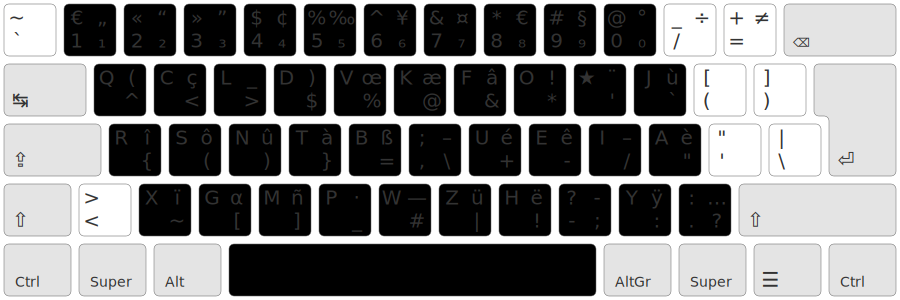

Ergaie 
================================================================================
/!\ Disclaimer : links aren’t functionnal yet.

A layout for French, English and programming. It’s a fork of Erglace which is a fork of [ErgEAU](https://github.com/IgrecL/ErgEAU), initially adapted for compact keyboards compatibility. It uses many conventions of [Ergo-L](https://github.com/Nuclear-Squid/ergol).

TL;DR
--------------------------------------------------------------------------------

* a keyboard layout optimized for French and English
* uses a dead key for the most frequent accented characters
* uses the AltGr layer for programming symbols
* fits on 30 keys for compact keyboards compatibility
* trades easy access to common shortcuts for full optimization
* lower SFB and LSB than most previous French layouts
* for those who are thinking about syllables as word compounds

See the [design notes](NOTES.md) for the details, and join the [Ergo-L discord](https://discord.gg/RH34GjQEgC) to discuss the layout with us. [Check the stats !][1]

[1]: https://lysquid.github.io/Erglace/stats#/erglace/ol40/en+fr

> La différence avec [Ergo-L](https://ergol.org/) ?
>
> Ergaie, dans la droite ligne d’Erglace abandonne l'accès facile au raccourcis usuels (Ctrl+C, Ctrl+V, ...) pour atteindre non pas de meilleurs statistiques en SFB, mais augmenter la présence de motifs mieux mémorisables basés sur la composition syllabique : par exemple, le digramme nc est moins mémorisable que le digramme en. En ce qui concerne les SFB, Erglace est, lui, sous les 1% ! Le SFB correspond aux enchaînements de deux caractères qui utilisent le même doigt, ce qui ralentit la vitesse de frappe. Ergaie se satisfait des SFB descendants, car ils vont dans le sens de la préhension et s’enchaînent plutôt bien.
>
> L'autre différence est qu'Ergaie, comme Erglace, cherche à minimiser les redirections, c'est-à-dire les enchaînements de trois caractères d'une même main avec un changement de direction, mouvement considéré comme inconfortable. Pour ce faire, toutes les voyelles se retrouvent d'un côté, comme en Bépo, ce qui favorise l'alternance des mains. Le désavantage est que la disposition a moins de roulements, c'est-à-dire des enchaînements de trois lettres d'une main dans une même direction, qui peuvent être appréciables. (à vérifier)
>
> Au-delà du placement des lettres, Ergaie, comme Erglace a les mêmes fonctionnalités qu'Ergo-L. La couche de symboles est directement reprise de ce dernier.
>
>Pour tirer le maximum de profit de cette disposition, adopter l’angl-mod (position dactylographique des bras en Λ) et décaler les touches y.-hz d’un cran vers la gauche est une suggestion utile. 
>
> La différence d’Ergaie avec Erglace tient essentiellement à la facilitation des motifs vocaliques du français par :
>* l’inversion a <–> i qui permet : ai vers l’intérieur,  -aie- est simplifié ainsi que -ie- -ieu-, rapproche le -oi-
>* l’inversion s <–> t qui permet : -sp- non sfb,  et -st- vers l’intérieur (plus accessoirement)
>*l’inversion j <–> y qui permet : un j’ (apostrophe typographique), plus simple sans abîmer le you (même sans décalage de la moitié gauche de la 3e rangée (rangée du bas).
>* Une réorganisation des accents pour mieux se rappeler de leur place.
>* pour le reste, Ergaie reprends Erglace et profite de beaucoup de mnémotechiques tels que : of, pl(a)c(e), c(o)q, bd, f(ol)k, euh, wx(y) et… j(’)ai()eu.

Layout
--------------------------------------------------------------------------------



The dead key <kbd>★</kbd> gives access to all accented letters you’ll need to write in proper French:


… and the AltGr layer is fully dedicated to programming symbols.


[Try it out!](in attempt)

Install
--------------------------------------------------------------------------------

You’ll need the latest version of [Kalamine][2] to build your own layout. We
*highly* recommend using [pipx][5], once you have it installed (by following
their guide), you can just run the following command:

```bash
pipx install kalamine
```

Download the [layouts/ergol.toml][4] file in this repo and build the layout :

```bash
kalamine ergaie.toml
```

You’ll get a `dist` folder containing all of the drivers.

Then, to install Erglace, follow the [install section of Kalamine’s repo][3],
and you should be good to go !

[2]: https://github.com/fabi1cazenave/kalamine
[3]: https://github.com/fabi1cazenave/kalamine#installing-distributable-layouts
[4]: layouts/ergaie.toml
[5]: https://github.com/pypa/pipx?tab=readme-ov-file#install-pipx


### Install (Linux only)

`xkalamine` is a linux‑specific tool (shipped with `kalamine`) to easily
install keyboard layouts on Linux. You can drop `sudo` if you use wayland, but
it’s required on Xorg.

```bash
sudo xkalamine install ergaie.toml  # Install the layout
```

Then switch to Ergo‑L using the following command:

```bash
setxkbmap fr -variant ergaie  # Switch your keyboard layout to ergaie
```

Make Your Own !
--------------------------------------------------------------------------------

If you wish to modify the layout, the `layouts/*.{toml,yaml}` are human-readable
ASCII arts of the final layout. You can easily edit them, then run `make` (or
`make watch`) at the root of the repo to generate the `.json` files used to
benchmark layouts on the [stats page][1].

This repo contains all of the code for the [Ergo‑L website](https://ergol.org),
so you can run the page locally to try your prototypes !
